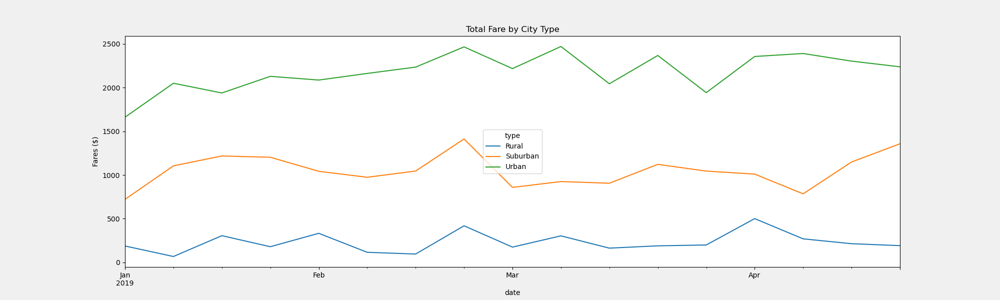
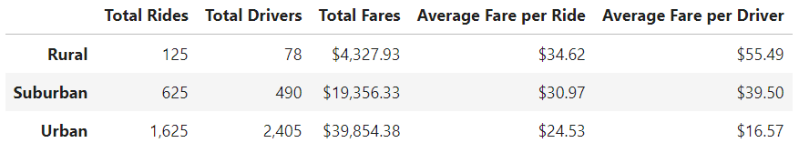

# PyBer Analysis

## Overview

Our [analysis](PyBer_Challenge.ipynb) looked at trends in ridesharing fares, trip frequency and driver totals in the three key market types in which PyBer operates: 
urban, suburban and rural cities. As PyBer plans its growth strategy, we wanted to assess where the greatest revenue opportunities lie and how to reach them.

We started with raw data listing details for each ride taken with PyBer in 2019. The details included date and time, fare amount and city, as well as the ride ID. 
We also had city-level data showing the city type and number of PyBer drivers. Uniting these data sets, we grouped the data by city type to pull out some 
noteworthy trends.

## Results
Revenues are clearly highest in urban markets, although fares are lowest there. The reverse is true for rural markets, while suburban areas fall in the middle of 
these two extremes.

The average fare per driver in rural areas is about 3.3x that in urban areas.  Drivers in rural areas also command much higher fares, whether due to the relative 
scarcity of drivers or to the likely longer distance involved in most trips. However, there were fewer than 80 total drivers and only 125 rides in rural cities 
in 2019, so the overall revenue impact was small.

PyBer customers may enjoy a price advantage in urban markets, given the larger number of drivers available through PyBer (and presumably other ride-sharing 
services). There are two factors that could account for the higher fares in rural areas. First, rural rides are most likely longer in terms of distance, given the 
fact that homes and businesses are more geographically spread out than in urban areas. Second, depending on how PyBer's ride-matching algorithm works, the relative 
scarcity  of drivers in rural areas may drive up fares. With few PyBer drivers on the rural roads, there is less competition for customers and greater capacity to 
charge higher prices.

## Summary

The path forward for PyBer depends on the company's goals in different geographic areas. 

If the top priority is to increase market share, PyBer should find ways to add drivers, particularly in suburban and rural areas. The more PyBer drivers are 
available to give rides at any given moment, the more likely customers are to choose PyBer for their trip. Also, rural and suburban trips likely tend to be longer 
in terms of distance, since homes and businesses are more spread out. This means that every trip added in one of these locations is likely to drive more revenue 
than a trip added in an urban area.

The relatively high number of drivers in urban areas, combined with the lower fares, suggests that urban markets may be close to saturation with ride-sharing 
drivers. Here PyBer should focus on optimizing its pricing strategy, perhaps by limiting the number of drivers on urban streets at certain times. This could 
create some driver scarcity that could justify higher fares. However, this strategy could backfire if implemented poorly, since customers will turn elsewhere if 
PyBer's service is not convenient or timely.

I recommend gathering more data that can drive more nuanced analysis of ride and fare trends. Data on trip distance would help PyBer assess the extent to which
fares in certain areas are higher because of trip length or because of other factors. Data on customer wait times and frequency of canceled trips would be useful 
for determining the extent to which PyBer is adequately meeting customer demand in various locations. For example, if customers in rural areas regularly have to 
wait a long time for a driver to pick them up, this suggests that it could be worthwhile to entice more people to drive for PyBer in these locations.
